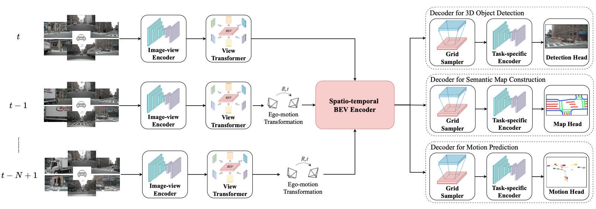
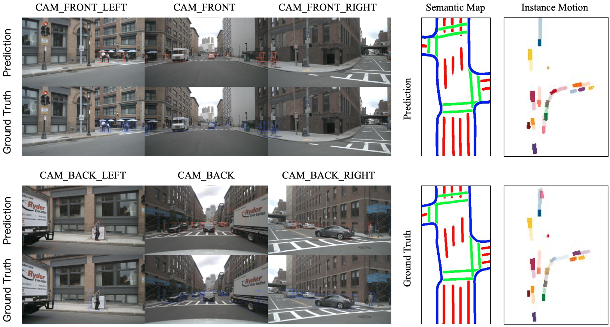

# BEVerse

The official implementation of the paper "BEVerse: Unified Perception and Prediction in Birds-Eye-View for Vision-Centric Autonomous Driving".

## Abstract
In this paper, we present BEVerse, a unified framework for 3D perception and prediction based on multi-camera systems. Unlike existing studies focusing on the improvement of single-task approaches, BEVerse features in producing spatio-temporal Birds-Eye-View (BEV) representations from multi-camera videos and jointly reasoning about multiple tasks for vision-centric autonomous driving. Specifically, BEVerse first performs shared feature extraction and lifting to generate 4D BEV representations from multi-timestamp and multi-view images. After the ego-motion alignment, the spatio-temporal encoder is utilized for further feature extraction in BEV. Finally, multiple task decoders are attached for joint reasoning and prediction. Within the decoders, we propose the grid sampler to generate BEV features with different ranges and granularities for different tasks. Also, we design the method of iterative flow for memory-efficient future prediction. We show that the temporal information improves 3D object detection and semantic map construction, while the multi-task learning can implicitly benefit motion prediction. With extensive experiments on the nuScenes dataset, we show that the multi-task BEVerse outperforms existing single-task methods on 3D object detection, semantic map construction, and motion prediction. Compared with the sequential paradigm, BEVerse also favors in significantly improved efficiency.

## Framework

## Visualization

